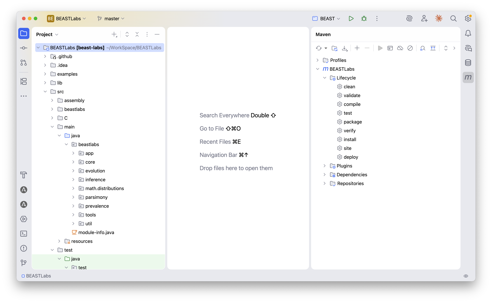

[](https://github.com/BEAST2-Dev/BEASTLabs/actions?query=workflow%3A%22BEASTLabs+tests%22)

# BEASTLabs

BEAST utility library containing generally useful classes used by other BEAST packages.

## Building

Requires Java 25 and Maven.

```bash
mvn compile
```

BEAST3 dependencies are resolved from GitHub Packages. You may need a
GitHub personal access token configured in your `~/.m2/settings.xml`:

```xml
<servers>
  <server>
    <id>github</id>
    <username>YOUR_GITHUB_USERNAME</username>
    <password>YOUR_GITHUB_TOKEN</password>
  </server>
</servers>
```

## Module

JPMS module name: `beast.labs`

Key exports:
- `beastlabs.core.util` — `Slice`, `ParameterConstrainer`
- `beastlabs.util` — `BEASTVector`, `Transform`
- `beastlabs.math.distributions` — `BernoulliDistribution`, `WeightedDirichlet`, `WeibullDistribution`
- `beastlabs.evolution.tree` — `RNNIMetric`, `RobinsonsFouldMetric`, `MonophyleticConstraint`
- `beastlabs.evolution.likelihood` — `ExperimentalTreeLikelihood`, `MultiPartitionTreeLikelihood`
- `beastlabs.evolution.operators` — tree operators, `CombinedOperator`
- `beastlabs.parsimony` — Fitch parsimony implementations

## BEAST3 migration status

Branch: `beast3`

All 142 source files compile against beast3 (`beast-base` 2.8.0-SNAPSHOT).

Changes from BEAST2:
- Maven multi-module build (was Ant)
- JPMS module `beast.labs` with `requires static` for beast-fx/javafx
- `commons-math` 2.x replaced with `commons-statistics` (immutable distribution API)
- `cern.colt.Arrays` replaced with `java.util.Arrays`
- `org.json` replaced with `beast.base.internal.json`
- Nashorn scripting via standalone `nashorn-core` dependency (removed from JDK)

TODO:
- [ ] Migrate tests from JUnit 4 to JUnit 5
- [ ] Add CI workflow (GitHub Actions)
- [ ] Add `version.xml` for BEAST package manager
- [ ] Add release script

## IntelliJ

It should look like this after following the developer guide https://github.com/CompEvol/beast3/blob/master/scripts/DevGuideIntelliJ.md

<a href="./IntelliJ.png"></a>

